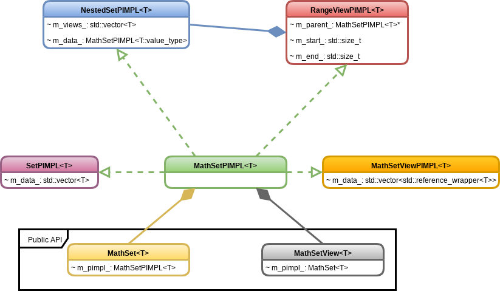

***********************
MathSet Developer Notes
***********************

The ``MathSet`` class models an ordered set. It natively (as opposed to free
functions) supports set-like operations such as union, intersection, difference,
and slicing. The notes on this page are meant primarily for developers wanting
to extend the ``MathSet`` class and/or understand how it works.

Design Points
=============

The ``MathSet`` class was primarily developed to serve as the backend container
for physics concepts that require:

- ordered, possibly nested, set-like storage,
- slicing (*i.e.* subset),
- basic set operation (union, intersection, etc.)

Additionally we require that the resulting object is reasonably efficient. In
particular this means:

- elements are stored contiguously when possible,
- nested sets are flattened,
- avoid copying when possible.

The ``MathSet`` class and all associated classes should have user-friendly
public APIs. In particular:

- meta-template programming should be hidden from user,
- user should be able to remain somewhat agnostic to view/instances,
- under-the-hood optimizations should not affect how the class is used

Current Solution
================

The above UML diagram summarizes the classes involved in making ``MathSet``
work. The public API of ``MathSet`` is implemented by two classes: ``MathSet``
and ``MathSetView``. Respectively, ``MathSet`` and ``MathSetView`` model a
``MathSet`` with value-like and pointer-like semantics. The details of how the
``MathSet`` and ``MathSetView`` classes work are decoupled from the public API
using the PIMPL idiom; however, because the PIMPL's are templated the details
can not be relegated to source files. ``MathSetPIMPL<T>`` defines the common API
all PIMPLs must implement and the remaining classes implement use-case specific
PIMPLs.

MathSet
-------

``MathSet<T>`` is the class users will originally make. To users it behaves
almost identically to an ``std::vector<T>`` except that it only stores unique
elements. Usually ``MathSet<T>`` will contain a PIMPL of type ``SetPIMPL<T>``,
but if ``T`` is another ``MathSet`` type then the PIMPL will be of
``NestedSetPIMPL``. A user constructed ``MathSet`` will never have a PIMPL of
``RangeViewPIMPL`` or ``MathSetViewPIMPL`` (unless the user explicitly gives
it one).

MathSetView
-----------

``MathSetView<T>`` behaves like a read-only ``MathSet<T>`` with the notable
exception that all of its elements are aliases of other ``MathSet<T>``
instances. The read-only restriction is currently in place to avoid unexpected
consequences of modifying the parent ``MathSet`` through an alias. Internally
the ``MathSetView<T>`` class works by holding a ``MathSet<T>`` instance with a
``MathSetViewPIMPL<T>`` PIMPL instance.

The ``MathSetView`` class can be implicitly converted to ``const MathSet<T>&``
and ``MathSet<T>``, the latter results in a deep copy of the aliased elements
into the resulting ``MathSet<T>`` instance. The implicit conversions allow users
to write generic functions like:

.. code-block:: c++

   void my_fxn_that_only_reads_a_set(const MathSet<T>& a_set) {
       // do stuff that needs to read the set
   }

   void my_fxn_that_modifies_a_set(MathSet<T> a_set) {
      // do stuff that modifies the set
   }

which will work with either ``MathSet`` or ``MathSetView`` instances.

There is a fair amount of boilerplate replication between ``MathSet`` and
``MathSetView``, but this is unavoidable on some level since we want them to
remain distinct classes (that way the user always knows whether they are dealing
with an alias or not) and we do not want to expose all of ``MathSet``'s API
through ``MathSetView`` (which public inheritance would do; protected/private
inheritance results in basically the same amount of boilerplate to forward the
methods we do want to expose).

MathSetPIMPL
------------

This class is relatively unremarkable aside from defining the API that all
PIMPLs must obey. At the moment this class also serves as code factorization for
implementing ``MathSet`` and ``MathSetView`` methods which have the same
implementation regardless of the PIMPL.

SetPIMPL
--------

This class is basically a wrapper around ``std::vector`` making sure it
satisfies the ``MathSetPIMPL`` API. Since ``MathSet``s are ordered we store the
elements in the order the user provided them. This makes access worst case
linear in the set's size. This could be improved at the cost of additional
memory by storing pointers/references to the elements in an internal
``std::set`` or ``std::unordered_set`` such that the pointers/references are
sorted by the values of the elements they alias.

NestedSetPIMPL
--------------

A ``NestedSetPIMPL<MathSet<T>>`` instance serves as the PIMPL for a
``MathSet<MathSet<T>>`` instance. Internally the ``NestedSetPIMPL<MathSet<T>>``
PIMPL holds a ``MathSet<T>`` instance with all of the actual data (*vide infra*)
and a series of ``MathSet<T>`` instances which have ``RangeViewPIMPL``
instances. The former is stored in the member ``m_data_`` and the latter in
``m_views_``. ``m_data_`` stores the actual data for each element of
``m_views_`` by concatenation (and not enforcing element uniqueness). The
elements of ``m_views_`` hold references to ``m_data_`` and their respective
starting and stopping indices. When a user requests an element of a
``MathSet<MathSet<T>>`` instance, the ``MathSet<T>`` instance returned comes
from ``m_views_``. While this technically means that the user is interacting
with an alias, this alias is coupled to a single ``MathSet<T>`` instance (the
one in ``m_views_``) and thus the usual aliasing problems do not apply.

RangeViewPIMPL
--------------

This PIMPL is used only by the ``NestedSetPIMPL<MathSet<T>>`` PIMPL, where it
serves as the PIMPL for the ``MathSet<T>`` instances in the nested set.

MathSetViewPIMPL
----------------

This PIMPL works and behaves almost identically to ``SetPIMPL<T>`` except that
instead of holding an ``std::vector<T>`` it holds the data as
``std::vector<std::reference_wrapper<T>>`` and requires an extra dereferencing
step to implement the PIMPL API. It serves as the PIMPL for the ``MathSet<T>``
instance wrapped by a ``MathSetView<T>`` instance.

